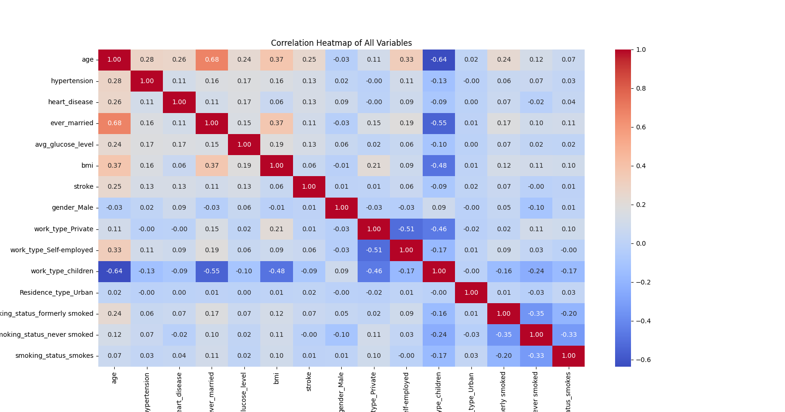

# Final Project: Data Analysis with Python

## Project Overview
This is a sample final project created for TEDA 1031 - Data Science with Python. Recall that the guiding question for this project is: *"How can I use Python to gain insight into a dataset?"* Feel free to use this README as a guiding template for your own project. 

## Table of Contents
- [Dataset](#dataset)
- [Data Cleaning](#data-cleaning)
- [Data Manipulation](#data-manipulation)
- [Exploratory Data Analysis (EDA)](#exploratory-data-analysis-eda)
- [Statistical Analysis](#statistical-analysis)
- [Conclusions](#conclusions)
- [How to Run the Code](#how-to-run-the-code)

## Dataset
**Source**: [Brain Stroke Dataset on Kaggle](https://www.kaggle.com/datasets/jillanisofttech/brain-stroke-dataset)

**Dataset Description**: This dataset contains demographic data on 4982 patients, in addition to uninvasive medical statistics, and whether or not they've had a stroke.

**Motivating Questions**: 
Is there a correlation between stroke risk and: 
- Gender?
- Age?
- Hypertension?
- Marriage?
- Residence Type?
- Average Glucose Level?
- BMI?
- Whether or not a patient smokes or used to smoke?

## Data Cleaning
- Missing or duplicate values: 
- Outlier detection: 
- Data consistency

*Note: Refer to code comments for specific loading & cleaning operations, such as data consistency checks and data type conversions.*

## Data Manipulation
- **Sorting**: Describe the sorting operations used, if any.
- **Filtering**: Explain any conditions applied to subset the data.
- **Grouping**: Mention the variables used for grouping and the purpose of this operation.
- **Merging**: If multiple datasets were merged, provide details about the merge process.
- **Reshaping**: Specify any reshaping done (e.g., pivoting or melting).

## Exploratory Data Analysis (EDA)
Descriptive Statistics by Potential Indicator: 

**Gender:**
Percent of women: 58.36% <br>
Percent of men: 41.64% 

**Age:**  
- mean = 43.42
- std = 22.66
- range = 81.92

**Glucose Level:**
- mean = 105.94
- std = 45.08
- range = 216.62

Percent of respondents with **hypertension**:  9.62% <br>
Percent of respondents with **heart disease**:  5.52% <br>
Percent of respondents that have been **married**:  65.85% <br>
Percent of respondents that **have never smoked**:  36.90% <br>
Percent of respondents that **formerly smoked**:  17.41% <br>
Percent of respondents that **currently smoke**:  15.58% <br>
Percent of respondents that have had a **stroke**:  4.98% <br>

Within this dataset, we can see that women constitute a slight majority (58.36%) of the respondents. The average age is 43.42 years, with a wide age range (0 to about 82 years) and a high standard deviation, indicating a diverse age distribution. Glucose levels also show significant variability, with an average of 105.94 and a large standard deviation (45.08). While the percentages of respondents with hypertension (9.62%), heart disease (5.52%), and a history of strokes (4.98%) are relatively low, these conditions might correlate with certain demographics like age or smoking habits. Most respondents have been married (65.85%). Smoking habits reveal that a majority either have never smoked (36.90%) or formerly smoked (17.41%), while only 15.58% are current smokers. 

## Statistical Analysis

**Correlation analysis:**



## Conclusions


## How to Run the Code
1. **Clone the Repository**:  
   ```bash
   git clone https://github.com/your-username/final-project.git
   cd final-project
   ```

2. **Install Required Libraries**:  
   Make sure to install all necessary packages. Run:
   ```bash
   pip install -r requirements.txt
   ```

3. **Run the Analysis Script**:  
   Execute the main Python script to reproduce the analysis:
   ```bash
   python analysis.py
   ```
